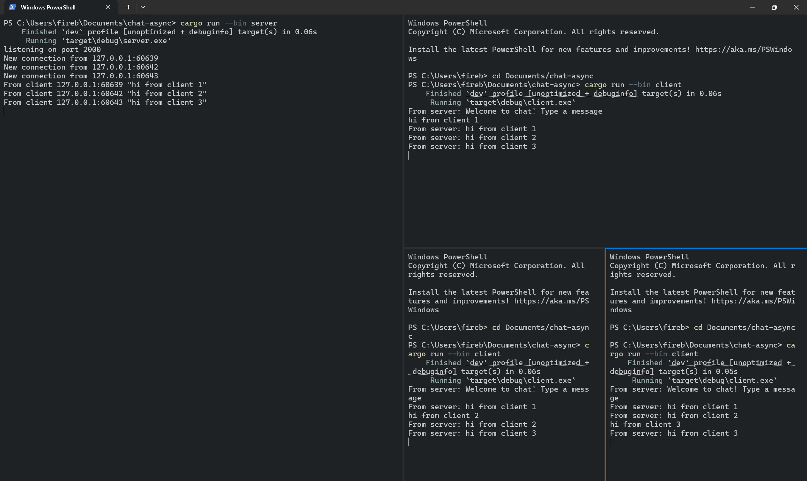
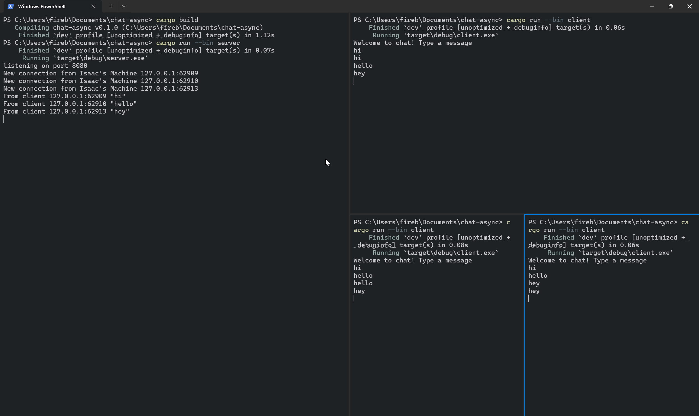

# Advanced Programming Module 10 - Async Chat
### Isaac Jesse Boentoro 2306256362

## Original code, and how it runs

1 terminal runs `cargo run --bin server`, while the other three run `cargo run --bin client`. When a client sends the server a message, it is broadcast to all other clients connected to server.

## Modifying ports
To modify the port number, we change the `TCPListener` port number in the server and client files.
The server does not explicitly declare the websocket handler , but it is implementing the protocol spec via the tokio websocket package.

## Small changes, add IP and Port

I changed the server and client side code because the server already keeps track which message comes from which address (because when a client connects, an async thread spawns). Each client is assinged a handler, which i can then edit the `addr` arguments of to insert the message.